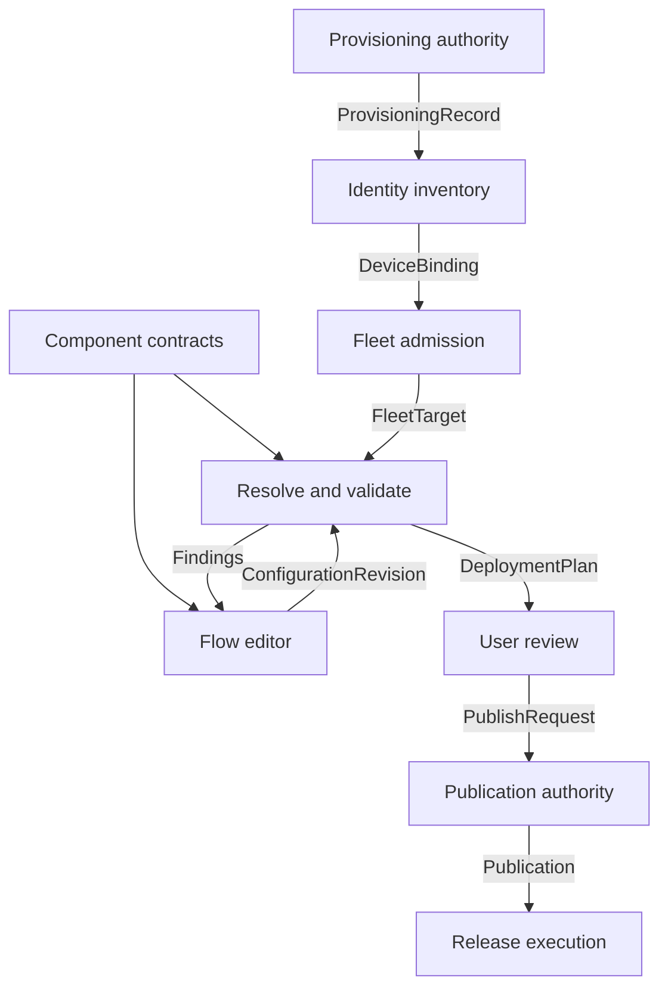

# System specification

Status: proposed. Normative requirements describe the intended shared boundary,
not already implemented production behavior. See [source baseline](sources.md).

## Objective

An operator can select admitted devices, compose a configuration using typed
graph components, review the exact resolved scope, and publish it. Every later
claim that a configuration is running must trace to an exact device instance,
resolved configuration, authorized publication, and verified release artifacts.

The architecture specifies logical responsibilities. Co-locating services does
not merge their authorization or key roles. Process count, language, transport,
datastore, and hosting provider are intentionally unspecified.

## Pipeline and handoffs

This diagram describes exported facts and dependencies, not a mandatory temporal
ordering of services. The upstream production enrollment transaction already
coordinates provisioning, RA, CA, pending verification, inventory activation,
and final audit. Its final `complete` state includes identity activation.
An evidence snapshot can be exported earlier for identity review; a completion
snapshot can follow activation. Consumers must not require a final completion
record to start the very activation needed to produce that record. Exporting a
`DeviceBinding` exposes authoritative inventory state; it need not initiate a
second enrollment transaction.

| Step | Accepts | Produces | Responsibility |
| --- | --- | --- | --- |
| Provisioning | Approved profile, transaction, exact target, independently scoped authority | ProvisioningRecord | Report observed outcome and independent evidence without granting fleet access |
| Identity activation | Bootstrap proof, operational-key proof, policy, provisioning evidence | DeviceBinding | Assign identity and activate the exact instance/slot/key/certificate tuple |
| Fleet admission | Current binding, tenant authorization, platform qualification and policy | FleetTarget | Decide whether the instance may participate and expose its constraints |
| Component publication | Reviewed component definition and implementation semantics | ComponentContract | Define configuration fields, connections, constraints, permissions and health requirements |
| Graph authoring | Component versions and user choices | ConfigurationRevision | Capture immutable declarative intent; retain an editable draft separately |
| Resolution | Graph, baseline, selected targets, platform profiles and allowed overrides | DeploymentPlan | Freeze exact instances, effective values, provenance, eligibility and prerequisites |
| User publication | Reviewed plan, expected desired-state revisions, authenticated actor | Publication | Durably accept exact intent without claiming execution success |

The catalog specifies which contracts have detailed schemas in this baseline.
An opaque reference to a deferred contract does not establish its semantics or
make it executable.

The [existing-device pilot](../contracts/pilot-enrollment.md) is a separate,
restricted admission path with versioned adoption, policy, decision and binding
records. It retains incomplete qualification and the installed storage/unlock
configuration. It does not inherit the original production deployment proposal's
online-unlock or A/B-update prerequisites below, and it does not grant publication
or deployment authority. The original wire records keep their existing meanings.

## Authority ownership

| Authority | Owns | Must not infer or grant |
| --- | --- | --- |
| Provisioning control and audit | Physical transaction state and evidence | Fleet access from a successful lane outcome |
| RA, CA, identity inventory | Identity assignment, constrained issuance, active tuples | Identity from an untrusted hostname, MAC, serial or CSR name |
| Fleet admission | Tenant membership and current participation decision | Hardware attestation from ordinary authenticated traffic |
| Configuration resolver | Deterministic effective intent and its provenance | An arbitrary ordering to hide conflicting values |
| Publication authority | Operator authorization and durable intent acceptance | Release signing or fresh boot authorization |
| Build and signing authorities | Artifact construction and separately authorized signatures | Customer-root use for every configuration update |
| Device and policy appraisal | Attempt observations and independent policy decisions | Success from acknowledgment, timeout, or an unchecked device report |

## Global invariants

- **SYS-01:** Logical device, provisioned instance, storage generation, credential
  slot, key generation, and certificate instance have distinct identities.
- **SYS-02:** Consumers MUST authenticate record origin and check current
  authority. Possession of a record or digest is not an authorization capability.
- **SYS-03:** Tenant and security-domain isolation apply at every handoff. Browser
  fields never select the authenticated principal or expand its authority.
- **SYS-04:** Private keys, unlock material, enrollment tokens, and secret values
  MUST NOT enter these contracts, public artifacts, Nix outputs, or audit payloads.
  Application secret configuration uses scoped references only.
- **SYS-05:** Plans freeze exact instances and resolved values. Edits, new group
  members, replacements, and newly eligible targets require a new reviewed plan.
- **SYS-06:** Accepted publication, successful build, release authorization,
  assignment, and confirmed execution are distinct facts.
- **SYS-07:** A lost response creates an unknown caller outcome. It never proves
  failure, success, or permission to repeat an irreversible operation.
- **SYS-08:** Current authorization is rechecked before consequential actions.
  A historically valid record does not override later quarantine or revocation.

## Fulfillment after publication

Execution consumes the accepted publication and resolved plan. It builds each
distinct effective configuration, produces digest-bound provenance, obtains
separate release authorization, then issues instance-bound assignments.
Assignments check expected desired-state versions again: a long-running build
must not overwrite a newer operator decision. Conflicts require reconciliation
or a new plan rather than automatic rebasing.

The device reports attempt identity, observed release and health; a policy
authority appraises evidence separately. Canary selection, real soak windows,
batch limits, stale/offline behavior, and recovery eligibility must be explicit
plan/execution policy. Unknown outcomes stop expansion. Offline targets remain
deferred until a newly authorized attempt can be created.

For the proposed Pi profile, Nix builds an authenticated read-only system release;
the update path uses qualified staging/activation and A/B recovery. Directly
mutating the running root with `nixos-rebuild switch` is not that profile's
deployment contract. Protected boot requires a fresh online authorization before
unlock. An earlier slot is usable for recovery only while its release remains
authorized. These are profile constraints, not universal requirements for all
future hardware.
